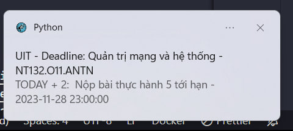
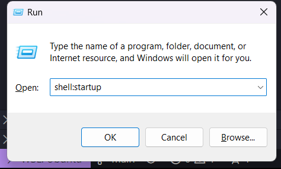

# uit-deadline-checking

## Platform
- Windows
- Moodle

## Chức năng
Lấy deadline trong vòng 7 ngày tới từ Moodle API rồi thông báo. App sẽ thông báo mỗi khi mở máy lên và lặp lại mỗi một tiếng, nếu mỗi khi có lỗi thì sẽ thử lại sau hai phút.



## Lý do :)
[26/11/2023] Ngày 22/11/2023 là lần đầu tiên mà mình quên nộp deadline UIT 🥹. Do có nhiều thứ cần làm nên quên mất, nên mình nghĩ cần có một cái gì nó thông báo cho mình mỗi lúc mở máy và nhắc lại sau một thời gian :v

## Cách dùng
- Cài đặt Python và pip.
- Cài đặt các gói 
    ```
    pip install -r requirements.txt
    ```
- Nhấn Windows + R để mở hộp thoại `cmd` và chạy lệnh `shell:startup`.

- Thư mục chứa các file thực thi sẽ chạy lúc mở máy lên sẽ mở lên, tạo shortcut tới file `run.bat` và để trong đó.

## Lưu ý
Do ở UIT có giới hạn một vài thứ nên sẽ không xử dụng được lúc dùng wifi tại UIT 😳, cách xử lý là dùng DNS 8.8.8.8 hoặc là sửa file host trỏ courses.uit.edu.vn tới thẳng IP public luôn 118.69.123.140.